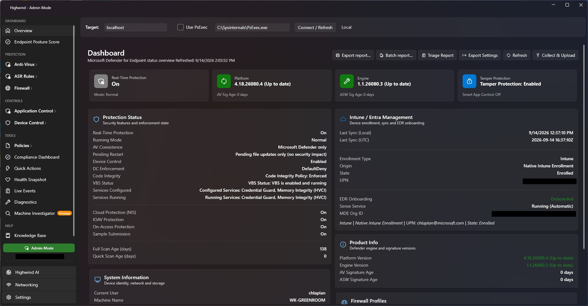
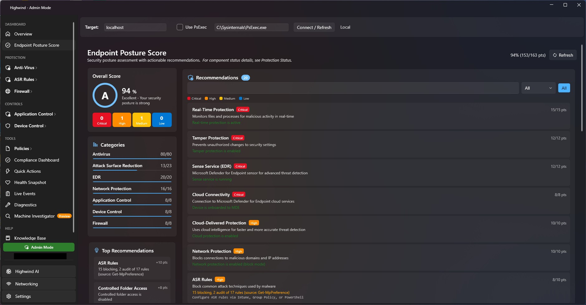
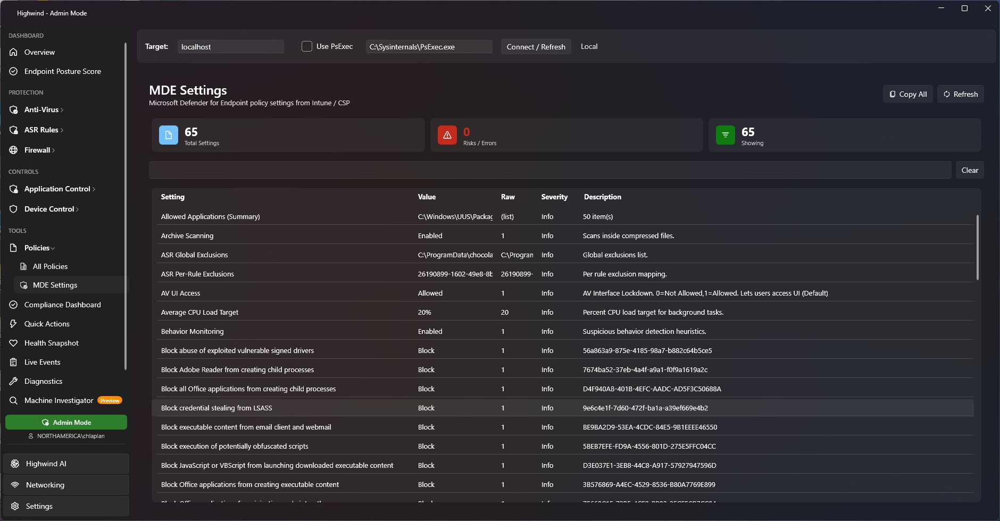
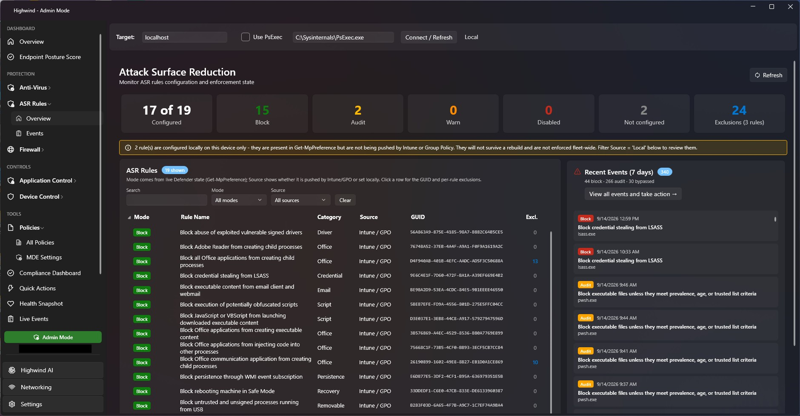
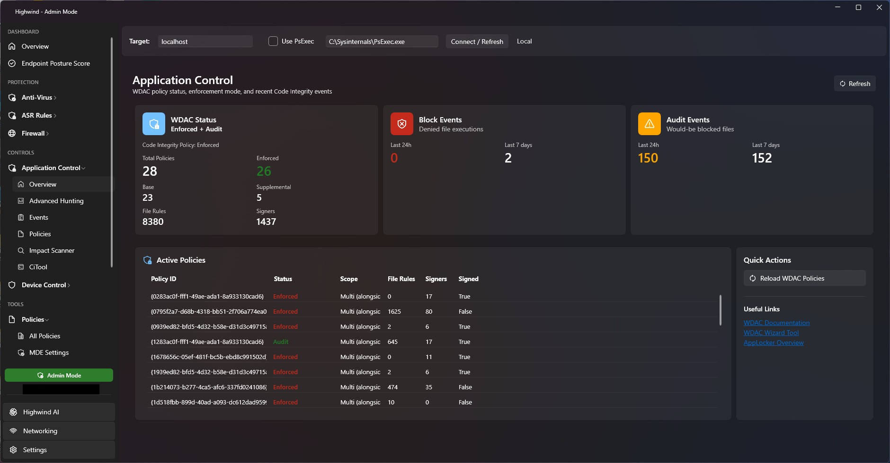
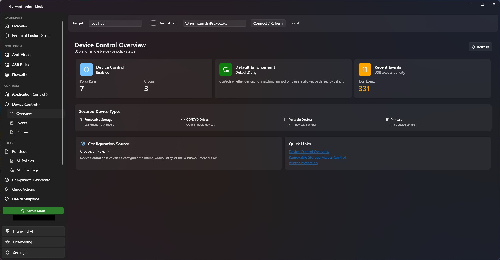
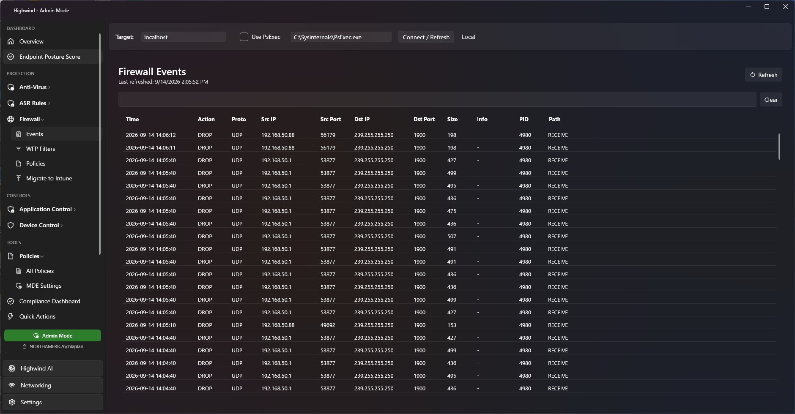
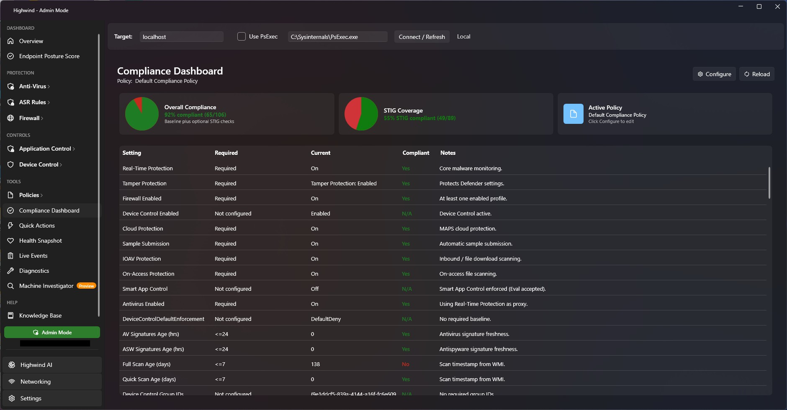
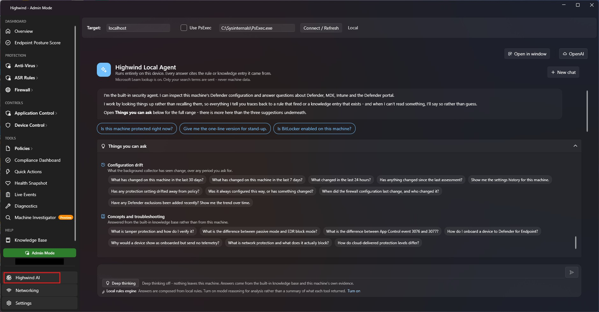
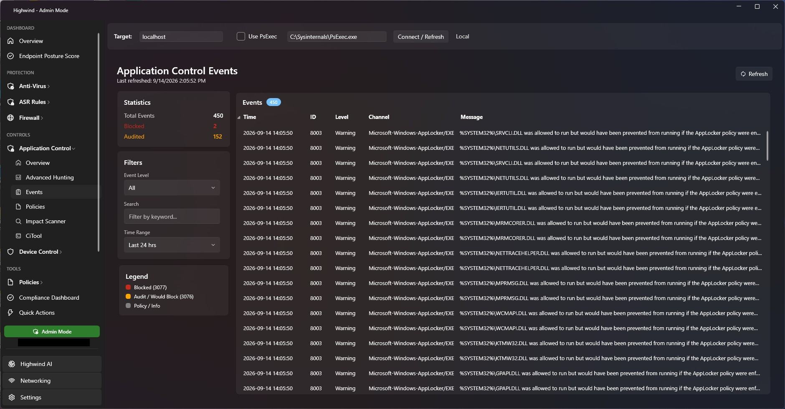

# Highwind

> **Previously released as MDE Toolkit.** The project is renamed to **Highwind** in 3.5.0 - same tool, same maintainer, new name. Existing enterprise policy under `HKLM\SOFTWARE\Policies\MDE-Toolkit` is migrated automatically on upgrade; see the [3.5.0 release notes](https://laplantelabs.com/version-history.html#v350) for the full list of renamed paths.

🌐 **Website:** [laplantelabs.com](https://laplantelabs.com)

Free, open-source desktop tool for monitoring and managing Microsoft Defender for Endpoint security posture. Built with WPF / .NET 8.

> This project is not affiliated with or endorsed by Microsoft. Microsoft offers no warranties, support, maintenance, performance assurances, or commitments regarding security, compliance, or fitness for a particular purpose.



## ✨ Features

### Security Monitoring
- **Endpoint Posture Score** — Comprehensive posture assessment with category breakdowns and remediation guidance
- **Defender Status** — Versions, real-time protection, signature ages, tamper protection, cloud states
- **MDE Onboarding** — Sense service status, onboarding verification
- **Firewall** — Profile status (Domain/Private/Public), recent DROP packets with text filter
- **Defender configuration drift** — Reads Defender's own configuration-change events and reports only the changes that touch protection. Compares the *source* as well as the value, so a setting that stopped being asserted by policy and fell back to a local value or the Windows default is reported even though its value never moved — drift that is invisible to any check that reads current state. Changes accumulate across runs, so a setting that keeps being switched back is reported as a pattern rather than as a one-off, long after the event log has rotated
- **What changed since last time** — A whole-machine assessment is compared against the previous one for the same machine: findings that are new, findings that have cleared, and how long a standing finding has stood. Comparisons are matched on privilege — an unelevated run sees less, so it is never differenced against an elevated one, which would report everything it could not read as "fixed". Recorded **locally only**, at `%LocalAppData%\Highwind\assessment-history.json`, and never transmitted anywhere
- **Settings history** — The background collector runs as SYSTEM every eight hours and keeps thirty days of snapshots; consecutive snapshots are compared to report which security settings changed and when. This covers the settings that emit no configuration event at all — the firewall profiles, App Control, Device Guard, BitLocker, Secure Boot, Remote Desktop, the PowerShell policy — and does not depend on the event log still holding the change. Because snapshots are taken as SYSTEM, what can be seen does not depend on who was signed in at the time. Read from the local cache only, never transmitted
- **Policy inventory** — Each snapshot also carries a flat map of the Defender, MDE, Intune/MDM, Group Policy and local security registry trees, so drift is detectable in settings nobody wrote a dedicated property for, and each change is **attributed** to the console that set it (Group Policy, Intune/MDM, Defender or local) — which the configuration-change event cannot tell you. Browser policy is excluded deliberately: on a typical managed machine Edge and Chrome account for ~97% of the Group Policy store and churn on their own. Enabled by default; set `CollectPolicyInventory` to `0` under `HKLM\SOFTWARE\Policies\Highwind` to turn it off
- **Setting reference** — A reported change is explained, not just listed: what the setting does, where it is configured in Intune (with the CSP path) and in Group Policy, the policy-managed and local registry keys, what the numeric values mean, and the behaviours that realistically cause it to move, ordered most-likely-first for that setting. Highwind also reads the registry live and says whether the value is being asserted by policy **right now**, so an investigation starts in the place that actually controls it. Where the originating policy object cannot be identified — which is usually — it says so plainly and names the five places evidence may still survive, rather than guessing
- **Ask over any period** — "in the last 5 days", "the last 24 hours", "the past two weeks" are read from the question and honoured, instead of every question being answered over whatever the snapshot cache spans. If the collector has less history than the period asked for, the answer says so rather than letting the quiet read as evidence; if changes fall outside the period, it says how many and when the nearest one was, so narrowing a question cannot hide a protection that was switched off the day before the window opens
- **Answers about the machine you asked about** — When Highwind is pointed at a remote machine, every tool reads *that* machine: platform and BitLocker state over its registry and WMI, settings history from the background collector's own snapshots on its administrative share, threat history through remote PowerShell. If it cannot be reached, Highwind says so and names it, rather than reporting your own workstation's values under another machine's heading — and it establishes that the machine answered before believing an empty read, so "no TPM" and "no threats in 90 days" are never produced by a conversation that never happened

### Policy & Configuration
- **Defender Policies** — Interpreted registry settings, ASR rule expansion, exclusion summaries
- **WDAC / App Control** — Auto-discovery (local & remote), summary counts, per-policy XML export, lazy/paged FileRules
- **Device Control** — USB / storage allow & deny events, policy viewer
- **ASR Rules** — Every rule with its enforcement mode (Block / Audit / Warn / Disabled) and where it came from (Intune / GPO / local), merged from the Policy Manager registry, the Exploit Guard GPO key and `Get-MpPreference`
- **ASR Events** — Block / audit / warn / bypass events grouped by rule + process + target, with filters, CSV export, generated hunting queries, and audited permanent or expiring exclusions (Admin Mode)

### Enterprise
- **Background Collection** — Silent scheduled task collection (SYSTEM) + upload (interactive user)
- **Function App Ingestion** — Azure Table Storage, Blob, Sentinel, or Dataverse backends
- **Registry-Driven Config** — All settings via `HKLM\SOFTWARE\Policies\Highwind`
- **Power BI Ready** — Flat table columns with ready-to-use Power Query and DAX measures

### Analysis & Export
- **AI Analysis** — Optional AI-powered security posture analysis
- **PDF Report** — Full snapshot export (includes WDAC XML, compliance, filters)
- **Highwind AI cover page** — Optional written assessment as the first page of the PDF/HTML report: the verdict, the cross-source concerns worth acting on, and what could not be read. Choose a **Security** focus (is this machine protected, and what weakens that), a **Troubleshooting** focus (what is not working, and what to fix first), or both. Off by default; nothing leaves the machine
- **Storage & Encryption section** — Per-volume disk capacity and BitLocker state in the report, using the same thresholds as the Overview card. "Could not be read" is reported distinctly from "not encrypted". Highwind AI reads the same figures, so a low-disk or unencrypted volume is weighed in the cover-page assessment rather than only being tabulated further down
- **JSON Export** — Machine-readable health report for automation
- **Compliance Snapshot** — JSON-driven policy baseline → pass/fail %

### Advanced
- **Remote Mode** — Target remote machines via UNC / WinRM / optional PsExec fallback
- **WFP Summary** — Filter counts + top rule names
- **Advanced Networking** — Deep network diagnostics
- **VBS / HVCI / Credential Guard** — Virtualization-based security status

## 🚀 Quick Start

**Download** the latest installer or ZIP from [GitHub Releases](https://github.com/chlaplan/Highwind/releases), or from [laplantelabs.com](https://laplantelabs.com).

### System Requirements
- Windows 10 version 1809+ or Windows 11
- .NET 8 Desktop Runtime
- Administrator privileges recommended for full functionality
- CiTool.exe requires Windows 11 22H2+ or Windows Server 2025+

## 🏢 Enterprise Deployment

Highwind supports fleet-wide deployment with centralized telemetry collection:

1. **Azure Setup** — Create Storage Account, Function App, Entra ID app registration
2. **MSI Deployment** — Silent install via SCCM, Intune, or GPO
3. **Registry Config** — Enterprise settings at `HKLM\SOFTWARE\Policies\Highwind`
4. **Scheduled Tasks** — Collect (SYSTEM) + Upload (interactive user) every 8 hours
5. **Power BI** — Connect to Table Storage for fleet dashboards

📖 Full guide: [Enterprise Setup](https://laplantelabs.com/enterprise-setup.html)

## 📸 Screenshots














## 🛠️ Build from Source

```bash
# Clone
git clone https://github.com/chlaplan/Highwind.git
cd Highwind

# Build (requires .NET 8 SDK)
dotnet build -c Release
```

### Building the MSI

The installer is a WiX v5 SDK-style project. The WiX toolset comes from NuGet, so no
separate install is needed — but Visual Studio cannot load `.wixproj` without the
HeatWave extension, so build it from the command line:

```bash
# Publish first — the installer harvests the publish folder, it does not
# reference the app project
dotnet publish "Highwind.csproj" -c Release -r win-x64 --self-contained -o publish

dotnet build installer/Highwind.Installer/Highwind.Installer.wixproj
```

`ProductVersion` in `Highwind.Installer.wixproj` must match `AssemblyFileVersion` in
`AssemblyInfo.cs`. The build fails if they diverge, or if the publish folder is older
than the source — Windows Installer will not replace a versioned file with one of the
same version, so a mismatch produces an MSI that installs cleanly and updates nothing.

## Configuration Files
- `Data/DefenderPolicyDefinitions.json` — Policy interpretation definitions
- `CompliancePolicy.config.json` — Compliance baseline rules

## Troubleshooting

| Symptom | Hint |
|---------|------|
| Empty WDAC list | No `*.cip` in `CodeIntegrity\CiPolicies\Active` or access denied |
| Missing ASR rules | `ASRRules` registry value not deployed |
| High WFP count warning | >10K filters (investigate layering) |
| PDF missing sections | Load data first (Refresh) |
| Upload fails | Ensure device is Entra ID / Hybrid joined with PRT |

## License

Released under the [MIT License](LICENSE).
